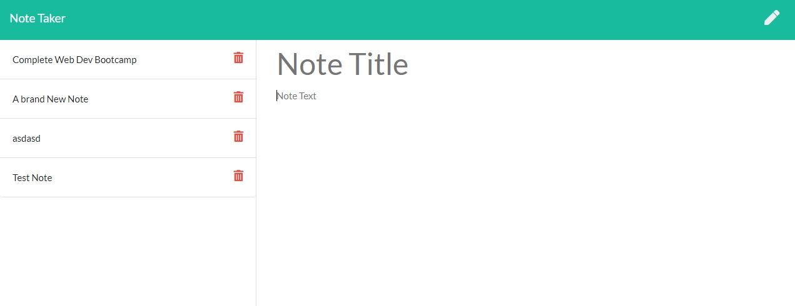

# Note-Taker

## Description

A website designed to create notes & view notes

## User Story
- AS A small business owner
- I WANT to be able to write and save notes
- SO THAT I can organize my thoughts and keep track of tasks I need to complete

## Project Breakdown

- The goal of the challenge is to create routes to allow the user to follow CRUD operations.
- A `server.js` file was created to initiate the server.
- I then create a routes folder
	- Within the routes folder I created 2 files. `apiRoutes.js` & `htmlRoutes.js`

## Usage

- User can create notes by inputting a Note Title as well as some note text.

Deployed heroku website found [HERE](https://jjms-note-taker.herokuapp.com/)

